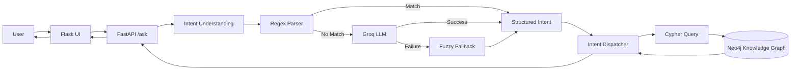
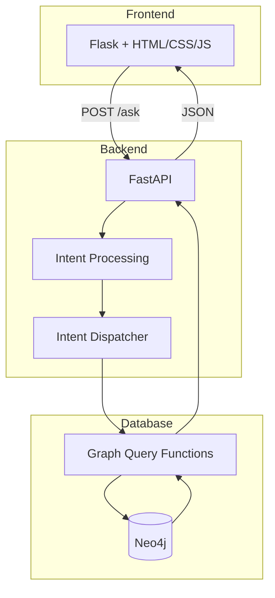
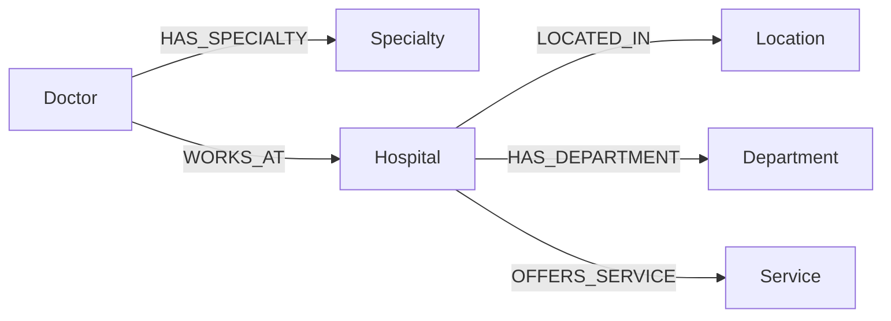

# Healthcare Knowledge Graph Assistant

A natural-language healthcare assistant built with **Neo4j, FastAPI, Flask, and Groq LLM**. It allows users to ask questions about doctors, hospitals, specialties, and locations without writing database queries.

### Example Queries

```text
Show cardiologists in South District
Tell me about Dr Arohi
Which doctors work at City Hospital?
Show hospitals in South District
```

---

## How It Works

The application uses a **hybrid intent-understanding pipeline**. Common queries are handled using fast regex rules, while more flexible questions are processed by the Groq LLM. If the LLM is unavailable or fails, a fuzzy fallback provides graceful degradation.



---

## System Architecture



---

## Intent Processing

The parser follows three stages:

```text
Natural Language Question
          |
          v
    Regex Fast Path
       /       \
    Match    No Match
      |          |
      v          v
   Intent      Groq LLM
                 |
            +----+----+
            |         |
         Success    Failure
            |         |
            v         v
          Intent   Fuzzy Fallback
                      |
                      v
                    Intent
```

The LLM produces a structured intent such as:

```json
{
  "intent": "doctors_by_specialty",
  "specialty": "Cardiology",
  "district": "South District"
}
```

The LLM is responsible for **understanding the question**, while the application controls which database query is executed.

---

## Knowledge Graph

Healthcare information is represented as connected entities in Neo4j.



This structure allows the system to answer relationship-based questions involving doctors, specialties, hospitals, departments, and locations.

---

## Project Structure

```text
KG-usecase/
├── app/
│   ├── database.py
│   ├── graph_queries.py
│   ├── load_data.py
│   └── test_suite.py
├── backend/
│   ├── llm.py
│   └── main.py
├── data/
│   └── healthcare CSV datasets
├── frontend/
│   ├── app.py
│   ├── static/
│   └── templates/
├── graph/
├── README.md
├── requirements.txt
└── .gitignore
```

### Main Components

| File                   | Purpose                                     |
| ---------------------- | ------------------------------------------- |
| `backend/llm.py`       | Regex parsing, LLM processing, and fallback |
| `backend/main.py`      | FastAPI REST API                            |
| `app/graph_queries.py` | Intent dispatch and Cypher queries          |
| `app/database.py`      | Neo4j database connection                   |
| `app/load_data.py`     | Loads healthcare data into Neo4j            |
| `frontend/app.py`      | Flask frontend/proxy                        |
| `app/test_suite.py`    | Automated testing                           |

---

## Reliability

The system is designed so that the LLM is **not a single point of failure**.

* Common queries avoid LLM usage through regex parsing.
* Unrecognized queries are sent to the Groq LLM.
* Rate limits and API errors trigger the fallback parser.
* Unknown queries return a controlled `unknown` intent instead of crashing the application.
* Database access is performed through predefined graph-query functions.

---

## API Flow

The main endpoint is:

```text
POST /ask
```

Request:

```json
{
  "question": "Show cardiologists in South District"
}
```

The backend processes the request as:

```text
Question
   ↓
Intent
   ↓
Graph Query
   ↓
Neo4j
   ↓
Results
   ↓
JSON Response
   ↓
Flask UI
```

---

## Testing

The project includes automated tests covering:

* Neo4j graph integrity
* Graph query correctness
* Intent extraction
* FastAPI endpoints
* Flask proxy
* Security and edge cases
* Concurrent requests

Latest test run:

```text
48 tests passed
100% success
```

---

## Technology Stack

* **Python**
* **Neo4j / Cypher**
* **FastAPI**
* **Flask**
* **Groq**
* **OpenAI GPT-OSS-120B**
* **Pydantic**
* **HTML / CSS / JavaScript**

---

## Setup

```bash
git clone https://github.com/sydelendure/healthcare-knowledge-graph-assistant.git
cd healthcare-knowledge-graph-assistant

python -m venv .venv
source .venv/bin/activate

pip install -r requirements.txt
```

Configure Neo4j and Groq credentials in `.env`:

```text
GROQ_API_KEY=your_groq_api_key
NEO4J_URI=your_neo4j_uri
NEO4J_USERNAME=your_neo4j_username
NEO4J_PASSWORD=your_neo4j_password
```

---

## Core Design

The project combines:

**Natural Language → Intent Understanding → Controlled Graph Query → Neo4j → Structured Results**

This provides a natural user interface while keeping database operations structured, predictable, and resilient to LLM failures.
