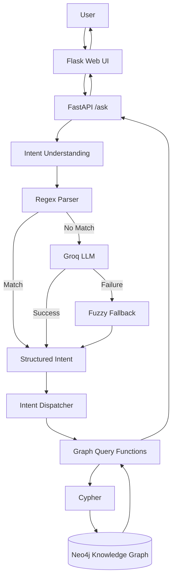
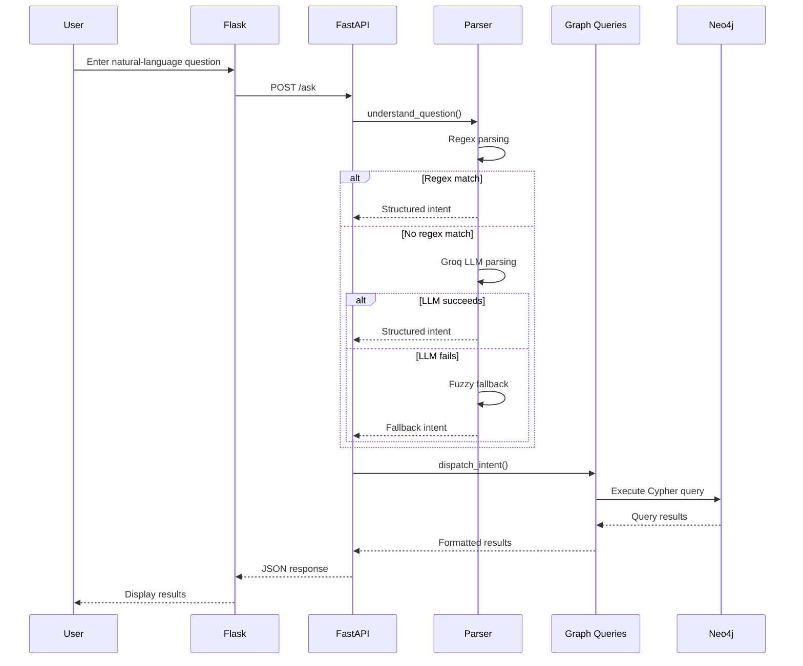
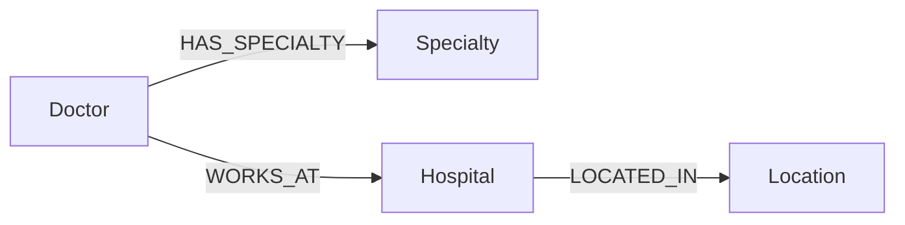
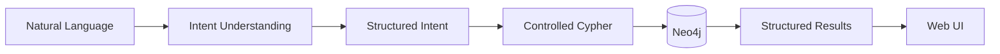

# Healthcare Knowledge Graph Assistant

A natural-language healthcare assistant built using **Neo4j Knowledge Graphs, FastAPI, Flask, and Groq LLM**.

The application allows users to ask healthcare-related questions in natural language, such as:

* "Show cardiologists in South District"
* "Tell me about Dr Arohi"
* "Which doctors work at City Hospital?"
* "Show hospitals in South District"

The system converts these questions into structured intents, queries a Neo4j healthcare knowledge graph, and presents the results through a web interface.

---

## Architecture

The application follows a layered architecture:



---

## End-to-End Flow



---

## Hybrid Intent Processing

The system uses three levels of processing:

| Stage          | Purpose                                       |
| -------------- | --------------------------------------------- |
| Regex Parser   | Fast handling of common query patterns        |
| Groq LLM       | Semantic understanding of free-form questions |
| Fuzzy Fallback | Recovery when LLM processing fails            |

Example:

```text
User Question
      ↓
Regex Parser
      ↓
Structured Intent
      ↓
Intent Dispatcher
      ↓
Cypher Query
      ↓
Neo4j
      ↓
Results
```

The LLM is used for **intent extraction**, while database operations are handled by predefined application logic.

---

## Knowledge Graph

The healthcare data is represented using connected entities:



This allows the application to answer relationship-based questions across doctors, specialties, hospitals, and locations.

---

## Project Structure

```text
KG-usecase/
├── app/
│   ├── database.py
│   ├── graph_queries.py
│   ├── load_data.py
│   └── test_suite.py
├── backend/
│   ├── llm.py
│   └── main.py
├── data/
│   └── *.csv
├── frontend/
│   ├── app.py
│   ├── static/
│   └── templates/
├── README.md
├── requirements.txt
└── .gitignore
```

### Main Components

**`backend/llm.py`**
Handles regex parsing, LLM intent extraction, and fuzzy fallback.

**`backend/main.py`**
FastAPI service and `/ask` endpoint.

**`app/graph_queries.py`**
Maps intents to controlled Cypher queries.

**`app/database.py`**
Handles Neo4j database connectivity.

**`app/load_data.py`**
Loads the healthcare dataset into Neo4j.

**`frontend/app.py`**
Flask application that serves the web interface and communicates with FastAPI.

**`app/test_suite.py`**
Automated tests for graph queries, intent extraction, APIs, security, edge cases, and concurrency.

---

## Technology Stack

* **Python**
* **Neo4j**
* **Cypher**
* **FastAPI**
* **Flask**
* **Groq**
* **OpenAI GPT-OSS 120B**
* **Pydantic**
* **HTML / CSS / JavaScript**

---

## Setup

Clone the repository:

```bash
git clone https://github.com/sydelendure/healthcare-knowledge-graph-assistant.git
cd healthcare-knowledge-graph-assistant
```

Create and activate a virtual environment:

```bash
python -m venv .venv
source .venv/bin/activate
```

Install dependencies:

```bash
pip install -r requirements.txt
```

Configure the required environment variables in `.env`:

```text
GROQ_API_KEY=your_groq_api_key
NEO4J_URI=your_neo4j_uri
NEO4J_USERNAME=your_neo4j_username
NEO4J_PASSWORD=your_neo4j_password
```

Load the healthcare data into Neo4j and start the backend/frontend services according to the project configuration.

---

## Testing

The project includes an automated test suite covering:

* Neo4j integrity
* Graph queries
* LLM/regex intent extraction
* FastAPI endpoints
* Flask proxy
* Security and edge cases
* Concurrent requests

Latest test run:

```text
48 tests passed
100% success
```

---

## Design Goal

The project combines the flexibility of **natural-language interaction** with the structured relationships of a **knowledge graph**.



The architecture is designed to minimize unnecessary LLM usage, provide graceful fallback behavior, and keep database operations controlled and predictable.
