# Healthcare Knowledge Graph Assistant

## Project Description

The **Healthcare Knowledge Graph Assistant** is a natural-language-powered application that enables users to interact with structured healthcare information through conversational queries.

The system uses a **Neo4j knowledge graph** to represent relationships between doctors, hospitals, medical specialties, and locations. Instead of requiring users to understand database queries or navigate through multiple filters, the application allows them to ask questions naturally, such as:

* "Show cardiologists in South District"
* "Find doctors in North District"
* "Which doctors work at City Hospital?"
* "Show hospitals in South District"
* "Tell me about Dr Arohi"

The application interprets the user's question, identifies the requested intent and relevant entities, translates that understanding into a controlled graph query, retrieves the corresponding information from Neo4j, and presents the results through a web interface.

The core challenge addressed by the project is that **natural-language input is unstructured, while the knowledge graph requires structured queries**.

To bridge this gap, the application implements a **hybrid intent-understanding pipeline** combining:

1. A fast, deterministic **regular-expression parser** for common query patterns.
2. An **LLM-based parser** using Groq's `openai/gpt-oss-120b` model for queries that require more flexible semantic understanding.
3. A **fuzzy fallback parser** that provides a deterministic recovery path when the LLM is unavailable, rate-limited, or returns an invalid response.

This architecture reduces unnecessary LLM calls, lowers latency for common queries, and prevents LLM failures from automatically propagating into the user-facing application.

---

# Problem Statement

Healthcare information is naturally relational.

A doctor may:

* Have one or more specialties.
* Work at a particular hospital.
* Be associated with a particular location.
* Have relationships with other healthcare entities.

Traditional search interfaces generally require users to select structured filters such as:

```text
Specialty → Cardiology
District  → South District
```

A natural-language interface instead allows the user to express the same request as:

```text
Show cardiologists in South District
```

The system therefore needs to solve two major problems.

### 1. Semantic Understanding

Users do not necessarily follow a predefined query format.

For example:

```text
Show cardiologists in South District
```

and:

```text
Which heart specialists are available in South District?
```

may represent the same underlying intent.

The application must identify:

```text
Intent      → doctors_by_specialty
Specialty   → Cardiology
District    → South District
```

### 2. Reliability

The application uses an external LLM for flexible natural-language interpretation. LLM APIs can experience:

* Rate limits
* API errors
* Invalid responses
* JSON parsing failures
* Temporary availability problems

The system therefore avoids making the LLM a single point of failure.

---

# Solution

The solution uses a **hybrid natural-language-to-knowledge-graph architecture**.

```text
Natural Language Question
          |
          v
   Fast Regex Parser
          |
     +----+----+
     |         |
   Match    No Match
     |         |
     |         v
     |       LLM Parser
     |         |
     |     +---+---+
     |     |       |
     |   Success  Failure
     |     |       |
     |     |       v
     |     |   Fuzzy Fallback
     |     |       |
     +-----+-------+
           |
           v
    Structured Intent
           |
           v
    Intent Dispatcher
           |
           v
     Graph Query Layer
           |
           v
          Neo4j
           |
           v
     Structured Results
           |
           v
       REST Response
           |
           v
      Flask Frontend
           |
           v
           User
```

The important architectural principle is that the LLM is responsible for **understanding the user's language**, not for directly controlling the database.

---

# Key Features

## Natural-Language Search

Users can interact with the healthcare graph using ordinary language rather than Cypher or structured filters.

## Hybrid Intent Detection

Common query patterns are processed using deterministic regular expressions before invoking the LLM.

## LLM-Based Semantic Parsing

More flexible queries are interpreted using Groq's:

```text
openai/gpt-oss-120b
```

## Fuzzy Fallback

If LLM processing fails, the application attempts deterministic fallback processing instead of immediately returning an LLM error.

## Neo4j Knowledge Graph

Healthcare entities and their relationships are represented in Neo4j.

## Controlled Graph Queries

The application maps recognized intents to predefined graph-query functions instead of allowing arbitrary LLM-generated database queries.

## REST API

FastAPI provides the backend `/ask` endpoint.

## Web Interface

Flask serves the browser-based interface and communicates with the FastAPI service.

## Automated Testing

The project includes tests covering the graph, intent extraction, API, frontend proxy, security, edge cases, and concurrency.

---

# Technology Stack

| Technology              | Role                               |
| ----------------------- | ---------------------------------- |
| Python                  | Application development            |
| Neo4j                   | Healthcare knowledge graph         |
| Cypher                  | Graph database query language      |
| FastAPI                 | REST API                           |
| Flask                   | Web frontend / API proxy           |
| Groq                    | LLM inference                      |
| `openai/gpt-oss-120b`   | Natural-language intent extraction |
| Regular Expressions     | Fast deterministic parsing         |
| Pydantic                | API request validation             |
| HTML / CSS / JavaScript | User interface                     |
| Pytest / Test Suite     | Automated validation               |

---

# System Architecture

The complete system consists of five major layers:

```text
┌───────────────────────────────────────────────┐
│                  Presentation                 │
│                                               │
│        Flask + HTML + CSS + JavaScript        │
└───────────────────────┬───────────────────────┘
                        │
                        ▼
┌───────────────────────────────────────────────┐
│                     API                       │
│                                               │
│              FastAPI /ask endpoint            │
└───────────────────────┬───────────────────────┘
                        │
                        ▼
┌───────────────────────────────────────────────┐
│              Intent Understanding             │
│                                               │
│       Regex → LLM → Fuzzy Fallback            │
└───────────────────────┬───────────────────────┘
                        │
                        ▼
┌───────────────────────────────────────────────┐
│               Query Processing                │
│                                               │
│          Intent Dispatcher + Cypher           │
└───────────────────────┬───────────────────────┘
                        │
                        ▼
┌───────────────────────────────────────────────┐
│                 Data Layer                    │
│                                               │
│          Neo4j Healthcare Knowledge Graph     │
└───────────────────────────────────────────────┘
```

## Mermaid: Complete System Architecture

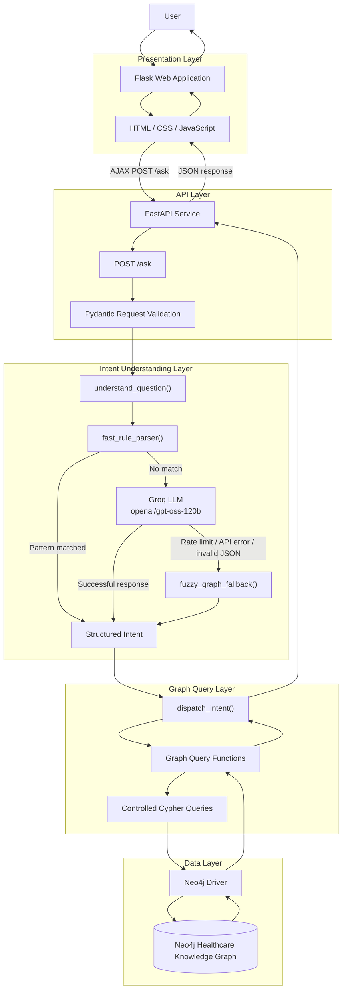

---

# End-to-End Request Flow

When a user submits a question, the request passes through the following stages.

## 1. User Input

Example:

```text
Show cardiologists in South District
```

## 2. Flask Frontend

The browser sends:

```json
{
  "question": "Show cardiologists in South District"
}
```

to the FastAPI `/ask` endpoint.

## 3. FastAPI

FastAPI receives and validates the request.

The request is then passed to:

```python
understand_question(question)
```

## 4. Intent Understanding

The system first attempts the fast regex parser.

If a matching pattern is found, the system immediately creates a structured intent.

Example:

```json
{
  "intent": "doctors_by_specialty",
  "specialty": "Cardiology",
  "district": "South District"
}
```

No LLM request is required.

If the regex parser cannot identify the query, the question is passed to the LLM.

## 5. LLM Processing

The LLM interprets the semantic meaning of the question and returns a structured intent.

If the LLM fails, the fuzzy fallback is executed.

## 6. Intent Dispatch

The structured intent is passed to:

```python
dispatch_intent(intent_dict)
```

The dispatcher determines which graph operation is required.

For example:

```text
doctors_by_specialty
        ↓
query_doctors_by_specialty_and_district()
```

## 7. Neo4j Query

The graph-query function executes a controlled Cypher query.

Conceptually:

```cypher
MATCH (d:Doctor)-[:HAS_SPECIALTY]->(s:Specialty)
WHERE s.name = $specialty
RETURN d
```

Additional graph relationships are used when filtering by hospital or location.

## 8. Result Processing

Neo4j records are converted into Python dictionaries.

The API returns the structured data as JSON.

## 9. Frontend Rendering

The Flask frontend receives the response and renders the appropriate UI component.

For example:

```text
Doctor
├── Name
├── Specialty
├── Hospital
└── Location
```

---

# Mermaid: End-to-End Request Flow

```mermaid
flowchart LR

    A["User enters question"]
    B["Flask UI"]
    C["POST /ask"]
    D["FastAPI"]
    E["understand_question()"]
    F["Structured Intent"]
    G["dispatch_intent()"]
    H["Cypher Query"]
    I[("Neo4j")]
    J["Query Results"]
    K["JSON Response"]
    L["Frontend Rendering"]
    M["User sees results"]

    A --> B
    B --> C
    C --> D
    D --> E
    E --> F
    F --> G
    G --> H
    H --> I
    I --> J
    J --> K
    K --> L
    L --> M
```

---

# Hybrid Intent-Understanding Pipeline

The most important part of the architecture is the hybrid parser.

The system does not send every question to the LLM.

Instead, it follows this decision process:

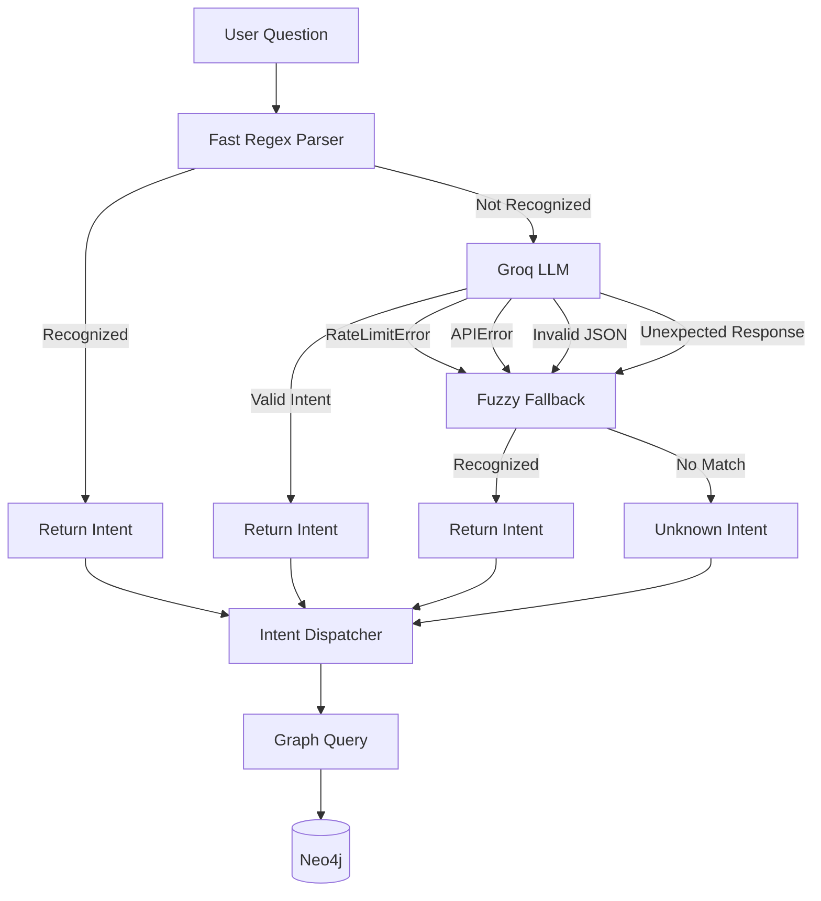

---

# Why Regex Is Used

Regular expressions provide a deterministic mechanism for recognizing common query patterns.

For example, a user may ask:

```text
Show cardiologists in South District
```

The parser can identify:

```text
Specialty → Cardiology
District  → South District
```

without calling the LLM.

This provides:

* Lower latency
* No LLM token consumption
* No dependency on the LLM for common requests
* Predictable behavior
* Reduced API load

Regex is therefore used as a **fast path**, not as a replacement for semantic understanding.

---

# Why the LLM Is Used

Regex cannot reliably understand every possible way a user can express an intention.

For example:

```text
Which doctors specialize in treating heart conditions around South District?
```

This may require semantic interpretation rather than simple keyword matching.

The LLM provides the flexibility required to interpret such free-form questions and convert them into the application's structured intent schema.

---

# LLM Failure and Fallback Flow

The LLM is not treated as a guaranteed dependency.

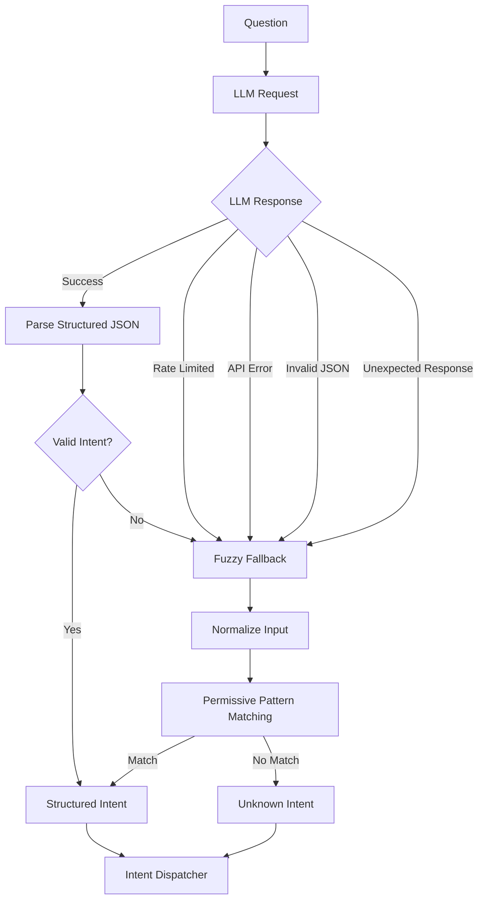

This design ensures that LLM failures are handled inside the intent-understanding layer rather than being propagated as uncontrolled exceptions.

---

# Knowledge Graph Model

The healthcare data is represented as interconnected entities.

A simplified conceptual model is:

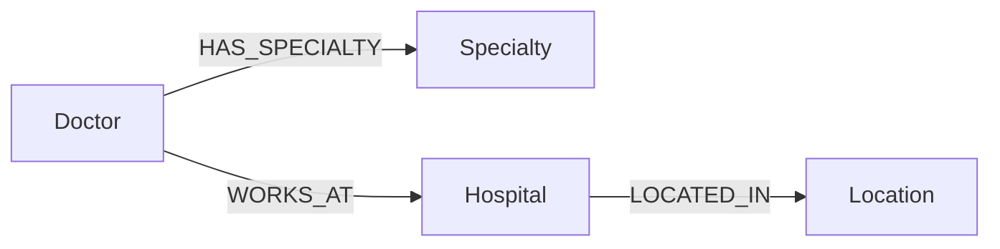

For example:

```text
Dr Arohi
   |
   | HAS_SPECIALTY
   v
Cardiology
   |
   |
Dr Arohi
   |
   | WORKS_AT
   v
City Hospital
   |
   | LOCATED_IN
   v
South District
```

The graph structure allows the application to traverse relationships between entities rather than treating each piece of information as an isolated record.

---

# Intent-to-Query Architecture

The LLM or regex parser produces an intent.

The dispatcher maps that intent to application-controlled query logic.

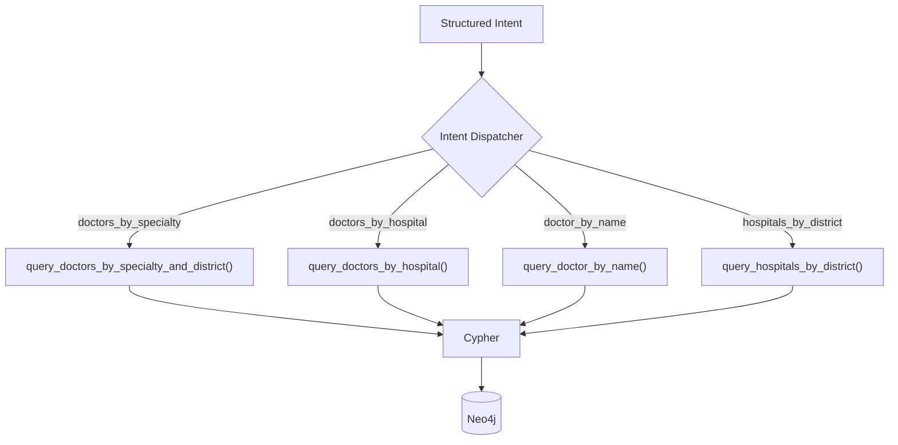

This separation is important because it prevents the natural-language model from becoming the direct database execution layer.

---

# Example Intent Transformation

### User Query

```text
Show cardiologists in South District
```

### Parsed Intent

```json
{
  "intent": "doctors_by_specialty",
  "specialty": "Cardiology",
  "district": "South District"
}
```

### Dispatcher

```text
doctors_by_specialty
        ↓
query_doctors_by_specialty_and_district()
```

### Graph Database

```text
Cypher
   ↓
Neo4j
   ↓
Matching Doctor Nodes
```

### API Response

```json
{
  "results": [
    {
      "name": "Dr Arohi",
      "specialty": "Cardiology",
      "hospital": "City Hospital",
      "location": "South District"
    }
  ]
}
```

### Frontend

The JSON response is converted into user-facing doctor cards.

---

# Backend Architecture

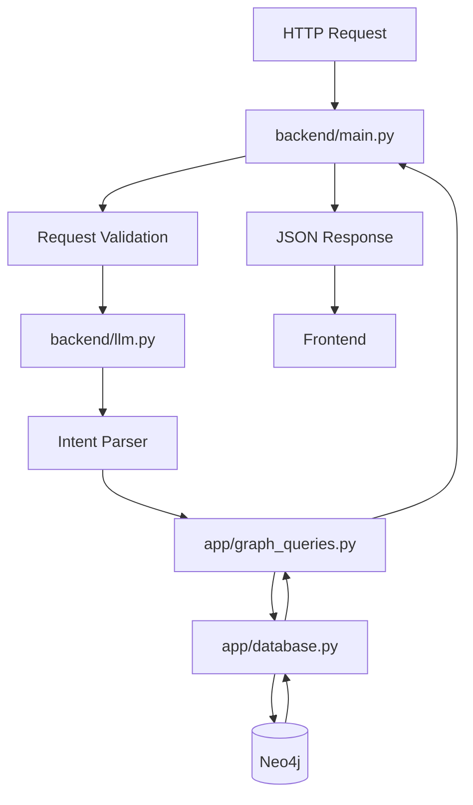

---

# Frontend Architecture

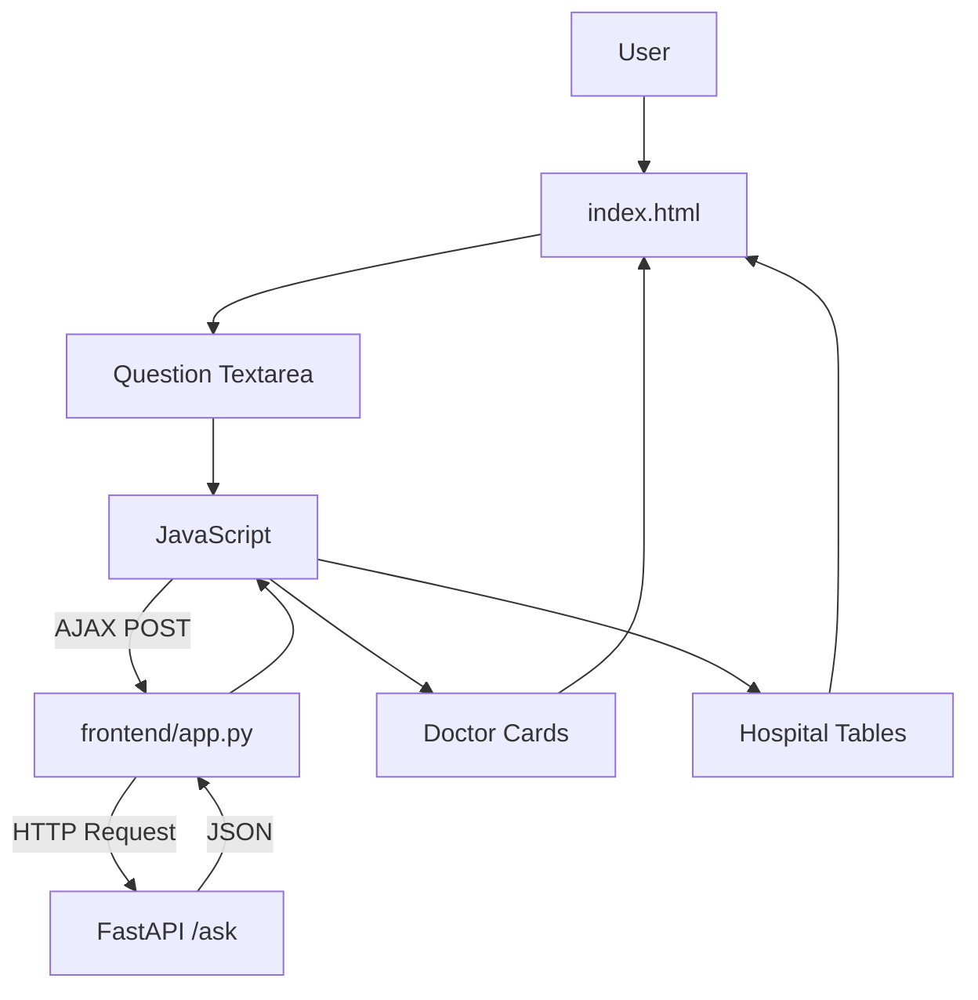

---

# Project Structure

```text
KG-usecase/
│
├── app/
│   ├── database.py
│   ├── graph_queries.py
│   └── test_suite.py
│
├── backend/
│   ├── main.py
│   └── llm.py
│
├── frontend/
│   ├── app.py
│   └── templates/
│       └── index.html
│
├── data/
│
├── graph/
│
├── .gitignore
├── README.md
└── requirements.txt
```

---

# Component Responsibilities

## `backend/main.py`

The main FastAPI application.

Responsible for:

* Creating the API application.
* Defining `/ask`.
* Validating incoming requests.
* Calling the intent-understanding layer.
* Dispatching intents.
* Returning JSON responses.
* Handling API-level errors.

## `backend/llm.py`

The natural-language understanding layer.

Responsible for:

* Regex-based parsing.
* LLM-based parsing.
* Structured intent extraction.
* LLM error handling.
* JSON validation/parsing.
* Fuzzy fallback processing.

## `app/graph_queries.py`

The graph query layer.

Responsible for:

* Intent dispatch.
* Cypher query functions.
* Doctor searches.
* Hospital searches.
* Specialty filtering.
* Location filtering.
* Doctor lookup operations.
* Formatting graph results.

## `app/database.py`

The Neo4j database layer.

Responsible for:

* Neo4j driver configuration.
* Database connectivity.
* Executing database operations.
* Managing interaction with the graph database.

## `frontend/app.py`

The Flask web application.

Responsible for:

* Serving the frontend.
* Receiving browser requests.
* Communicating with FastAPI.
* Returning API results to the browser.

## `frontend/templates/index.html`

The primary web interface.

Responsible for:

* Search input.
* Result presentation.
* Doctor cards.
* Hospital tables.
* Dark-mode interaction.
* New Search interaction.
* Client-side API communication.

## `app/test_suite.py`

The project's automated validation layer.

Responsible for testing:

* Graph integrity.
* Graph query correctness.
* Intent extraction.
* API behavior.
* Flask proxy behavior.
* Security-related edge cases.
* Concurrency behavior.

---

# API

## POST `/ask`

The main application endpoint.

### Request

```json
{
  "question": "Show cardiologists in South District"
}
```

### Processing

```text
Request
   ↓
Validation
   ↓
Intent Understanding
   ↓
Intent Dispatch
   ↓
Cypher
   ↓
Neo4j
   ↓
Result Formatting
```

### Response

The API returns structured JSON containing the result of the requested graph operation.

---

# Testing

The project includes a comprehensive automated test suite.

The test categories include:

| Test Category     | Purpose                                 |
| ----------------- | --------------------------------------- |
| Neo4j Integrity   | Validate nodes and relationships        |
| Graph Queries     | Validate Cypher query behavior          |
| Intent Extraction | Validate parser behavior                |
| FastAPI           | Validate API endpoints                  |
| Flask Proxy       | Validate frontend/backend communication |
| Security          | Validate malicious and malformed inputs |
| Edge Cases        | Validate unusual requests               |
| Concurrency       | Validate simultaneous requests          |

The latest reported test execution achieved:

```text
48 tests passed
100% success
```

The test suite should be rerun after significant application, database, or dependency changes.

---

# Reliability Model

The application's reliability strategy is based on reducing unnecessary external dependencies.

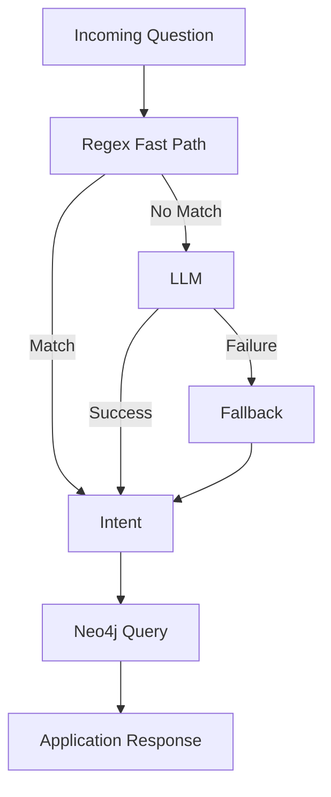

The architecture provides graceful handling of failures in the LLM intent-extraction stage.

However, the fallback does not eliminate failures caused by other infrastructure components. For example, if Neo4j is unavailable, graph queries cannot be executed.

---

# Security Architecture

The application separates language interpretation from database execution.

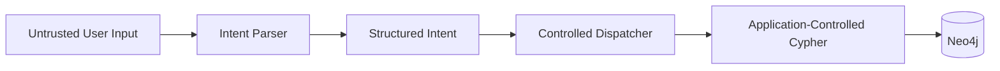

The system does not rely on the LLM to independently generate and execute arbitrary database operations.

The test suite also considers:

* Injection attempts
* XSS-style input
* Path traversal
* Large payloads
* Invalid request structures
* Unexpected parser output

---

# Performance Strategy

The main optimization is the regex fast path.

Without the hybrid approach:

```text
Every query
     ↓
LLM
     ↓
Token consumption
     ↓
API latency
```

With the hybrid approach:

```text
Every query
     ↓
Regex
   /     \
Match   No Match
 |          |
Intent      LLM
            |
          Intent
```

This means common query patterns can be processed without consuming LLM tokens.

The concurrency test suite also evaluates simultaneous requests to identify performance or blocking issues in the application.

---

# Example User Queries

The application is designed to support natural-language questions such as:

### Doctor Search

```text
Show cardiologists in South District
```

### Doctor Lookup

```text
Tell me about Dr Arohi
```

### Hospital Search

```text
Show hospitals in South District
```

### Hospital-Based Search

```text
Which doctors work at City Hospital?
```

### Location Search

```text
Find doctors in North District
```

The supported query types depend on the intents implemented in the current version of the application.

---

# Design Decisions

## Why Neo4j?

Healthcare information contains many relationships between entities.

Neo4j represents these relationships directly through nodes and edges, making graph traversal natural for relationship-oriented queries.

## Why FastAPI?

FastAPI provides a lightweight REST API layer with request validation and a clear separation between the frontend and backend.

## Why Flask?

Flask provides a simple web-facing layer for serving the user interface and proxying requests to the FastAPI backend.

## Why Regex?

Regex provides a fast deterministic path for common query patterns without requiring an LLM request.

## Why an LLM?

Regex cannot capture every natural-language variation. The LLM provides semantic understanding for more flexible user queries.

## Why a Fallback?

An external LLM should not become the only mechanism through which the application can interpret supported queries. The fallback provides an additional recovery path when LLM processing fails.

## Why Controlled Cypher?

The application separates natural-language interpretation from database execution. This provides greater control over the database operations that can be performed.

---

# Complete Architecture Overview

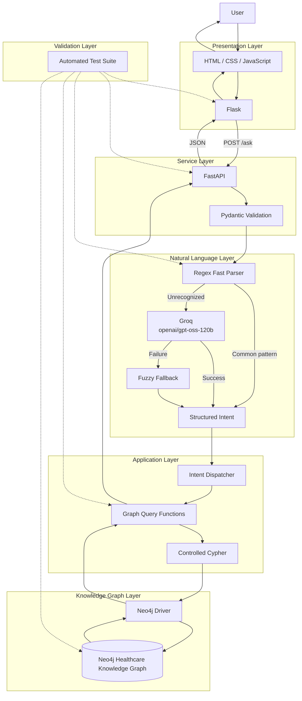

---

# Future Enhancements

Potential improvements include:

* Additional healthcare intents.
* More sophisticated entity recognition.
* Semantic entity matching.
* Multi-condition healthcare queries.
* Doctor availability information.
* Appointment-related functionality.
* Graph-based recommendations.
* Authentication and authorization.
* API rate limiting.
* Query caching.
* Structured logging and monitoring.
* CI/CD using GitHub Actions.
* Expanded load and stress testing.
* Production deployment configuration.

---

# Conclusion

The Healthcare Knowledge Graph Assistant demonstrates how **natural-language processing, LLMs, deterministic parsing, REST APIs, and graph databases can be combined into a single healthcare search system**.

The architecture intentionally separates responsibilities:

```text
Natural Language
       ↓
Intent Understanding
       ↓
Structured Intent
       ↓
Controlled Query
       ↓
Neo4j Knowledge Graph
       ↓
Structured Response
       ↓
Web Interface
```

The hybrid intent pipeline is the central design element. Common queries can be processed quickly using deterministic rules, while more flexible questions can use the LLM. If LLM processing fails, the fallback mechanism provides an additional recovery path.

This allows the application to combine the flexibility of natural-language interaction with the structure, relationships, and queryability of a knowledge graph.
