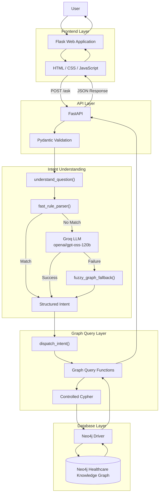
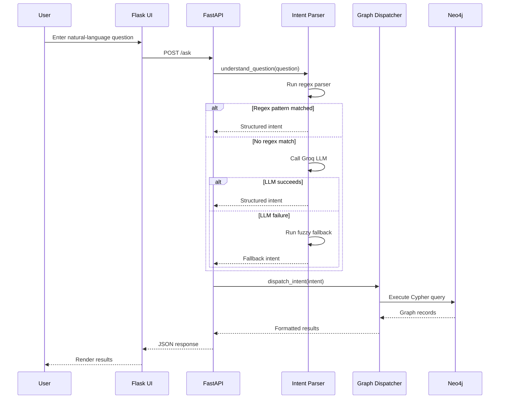
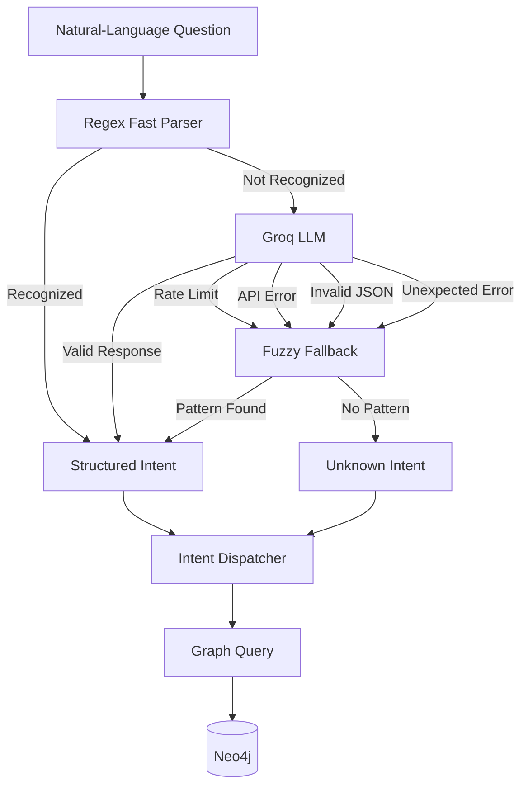
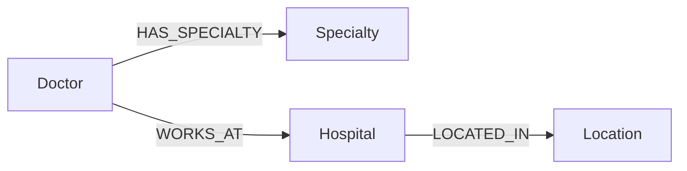
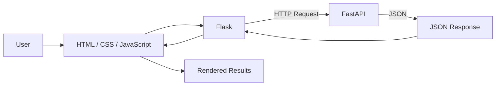
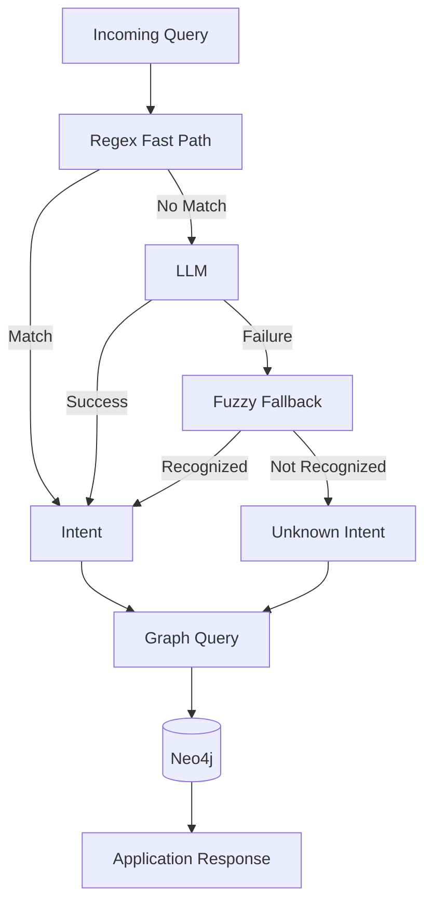
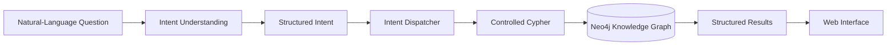

# Healthcare Knowledge Graph Assistant

A natural-language-powered healthcare assistant that enables users to query structured healthcare information using conversational questions.

The application combines a **Neo4j Knowledge Graph**, **FastAPI**, **Flask**, and **Groq LLM** to translate natural-language questions into structured intents and retrieve relevant information about doctors, hospitals, specialties, and locations.

Example questions include:

```text
Show cardiologists in South District
Tell me about Dr Arohi
Which doctors work at City Hospital?
Show hospitals in South District
Find doctors in North District
```

The goal is to provide a simple natural-language interface over a structured knowledge graph without requiring users to understand Cypher or database schemas.

---

## Project Overview

Healthcare information contains many relationships:

* Doctors have specialties.
* Doctors work at hospitals.
* Hospitals are located in specific districts.
* Healthcare services are associated with hospitals and departments.

A relational or filter-based interface requires users to explicitly provide these values. This project allows users to express the same requirements naturally.

For example:

```text
Show cardiologists in South District
```

is interpreted as:

```text
Intent:      doctors_by_specialty
Specialty:   Cardiology
District:    South District
```

The structured intent is then mapped to a predefined graph query and executed against Neo4j.

---

# Problem Statement

The project addresses two primary challenges.

### 1. Natural-Language Understanding

Users can express the same requirement in many different ways.

For example:

```text
Show cardiologists in South District
```

and:

```text
Which heart specialists are available in South District?
```

may represent the same underlying request.

The system therefore needs to identify:

* User intent
* Relevant entities
* Specialty
* Doctor name
* Hospital
* District or location

### 2. LLM Reliability

The application uses an external LLM for flexible language understanding. However, an LLM API can experience:

* Rate limits
* API errors
* Invalid responses
* JSON parsing failures
* Temporary availability issues

The application therefore uses a hybrid architecture where the LLM is **not the only mechanism for interpreting queries**.

---

# Solution

The system uses three levels of intent processing:

1. **Regex Fast Path** — handles common and predictable query patterns without an LLM call.
2. **LLM Parsing** — handles queries that cannot be recognized by the deterministic parser.
3. **Fuzzy Fallback** — provides a recovery mechanism when LLM processing fails.

The resulting structured intent is passed to a controlled query-dispatch layer, which executes the appropriate Cypher query against Neo4j.

---

# System Architecture



---

# End-to-End Request Flow

When the user submits a question, the request follows this pipeline:



---

# Hybrid Intent Processing

The hybrid parser is the central component of the application.

## Stage 1: Regex Parser

The system first checks whether the question matches one of the known query patterns.

For example:

```text
Show cardiologists in South District
```

can be identified without an LLM request.

The parser extracts the relevant information and produces an intent such as:

```json
{
  "intent": "doctors_by_specialty",
  "specialty": "Cardiology",
  "district": "South District"
}
```

This fast path provides:

* Lower latency
* No LLM token consumption
* Predictable behavior
* Reduced external API dependency

## Stage 2: LLM Parsing

If the regex parser cannot recognize the query, the application sends the question to Groq using:

```text
openai/gpt-oss-120b
```

The LLM is instructed to return a structured intent rather than directly querying Neo4j.

For example:

```json
{
  "intent": "doctor_by_name",
  "doctor_name": "Dr Arohi"
}
```

## Stage 3: Fuzzy Fallback

If the LLM fails because of a rate limit, API error, invalid JSON, or another parsing problem, the application uses:

```text
fuzzy_graph_fallback()
```

The fallback normalizes the input and attempts more permissive pattern matching.

If nothing can be identified, the system returns a valid:

```json
{
  "intent": "unknown"
}
```

rather than allowing an LLM exception to propagate through the application.

---

# Intent Processing Flow



---

# Knowledge Graph

The healthcare information is represented as a graph of connected entities.

The core entities include:

* Doctor
* Specialty
* Hospital
* Location
* Department
* Service

A simplified relationship model is:



The graph model allows the application to traverse relationships instead of treating doctors, hospitals, and locations as isolated records.

For example:

```text
Doctor
   │
   ├── HAS_SPECIALTY ──> Cardiology
   │
   └── WORKS_AT ──────> City Hospital
                              │
                              └── LOCATED_IN ──> South District
```

---

# Intent-to-Query Dispatch

The application does not allow the LLM to directly execute arbitrary database operations.

Instead, the structured intent is passed to:

```text
dispatch_intent()
```

The dispatcher selects the appropriate application-controlled graph query.


This separation provides better control over the database layer and prevents natural-language input from becoming unrestricted database execution.

---

# Example Query

### User

```text
Show cardiologists in South District
```

### Intent

```json
{
  "intent": "doctors_by_specialty",
  "specialty": "Cardiology",
  "district": "South District"
}
```

### Dispatcher

```text
doctors_by_specialty
        ↓
query_doctors_by_specialty_and_district()
```

### Database

```text
Structured Intent
        ↓
Controlled Cypher
        ↓
Neo4j
        ↓
Matching records
```

### Response

The resulting records are converted into JSON and returned to the frontend.

The UI can then display information such as:

```text
Doctor Name
Specialty
Hospital
Location
```

---

# Project Structure

```text
KG-usecase/
│
├── app/
│   ├── __init__.py
│   ├── database.py
│   ├── graph_queries.py
│   ├── load_data.py
│   └── test_suite.py
│
├── backend/
│   ├── llm.py
│   └── main.py
│
├── data/
│   ├── departments.csv
│   ├── doctors.csv
│   ├── hospital_connections.csv
│   ├── hospitals.csv
│   ├── locations.csv
│   ├── services.csv
│   └── specialities.csv
│
├── frontend/
│   ├── app.py
│   ├── static/
│   │   └── style.css
│   └── templates/
│       └── index.html
│
├── graph/
├── README.md
├── requirements.txt
└── .gitignore
```

The `graph/` directory is reserved for graph-related resources. Empty directories are not tracked by Git.

---

# Component Responsibilities

| Component                       | Responsibility                              |
| ------------------------------- | ------------------------------------------- |
| `backend/main.py`               | FastAPI application and `/ask` endpoint     |
| `backend/llm.py`                | Regex parsing, LLM parsing, fallback logic  |
| `app/graph_queries.py`          | Intent dispatch and Cypher query functions  |
| `app/database.py`               | Neo4j driver and database connectivity      |
| `app/load_data.py`              | Loading healthcare data into Neo4j          |
| `frontend/app.py`               | Flask web application and API communication |
| `frontend/templates/index.html` | Main user interface                         |
| `frontend/static/style.css`     | UI styling and visual design                |
| `app/test_suite.py`             | Automated application and integration tests |
| `data/`                         | Healthcare CSV datasets                     |

---

# Frontend

The frontend is implemented using Flask with HTML, CSS, and JavaScript.

The interface provides:

* Natural-language query input
* Search interaction
* New Search functionality
* Dark-mode toggle
* Doctor result cards
* Hospital result tables
* API-driven result rendering

The frontend communicates with the FastAPI backend rather than accessing Neo4j directly.



---

# API

The primary backend endpoint is:

```text
POST /ask
```

### Request

```json
{
  "question": "Show cardiologists in South District"
}
```

### Processing

```text
POST /ask
    ↓
Request Validation
    ↓
Intent Understanding
    ↓
Intent Dispatch
    ↓
Cypher Query
    ↓
Neo4j
    ↓
Result Formatting
    ↓
JSON Response
```

FastAPI and Pydantic provide structured request validation before the request reaches the application logic.

---

# Reliability and Fallback Strategy

The architecture avoids making the LLM a single point of failure.



The fallback protects the **intent-understanding stage** from common LLM failures.

It does not eliminate failures from infrastructure dependencies such as an unavailable Neo4j database.

---

# Security Considerations

The application separates:

```text
User Input
     ↓
Intent Extraction
     ↓
Controlled Intent
     ↓
Predefined Query Logic
     ↓
Neo4j
```

The LLM is used for language interpretation rather than unrestricted database execution.

The test suite also includes checks for:

* Injection-style inputs
* XSS-style inputs
* Path traversal
* Large payloads
* Invalid request structures
* Unexpected parser responses

---

# Testing

The project includes an automated test suite covering multiple layers of the application.

| Category          | Coverage                                            |
| ----------------- | --------------------------------------------------- |
| Neo4j Integrity   | Nodes, relationships, and graph consistency         |
| Graph Queries     | Specialty, district, hospital, and related queries  |
| Intent Extraction | Regex, LLM, and fallback behavior                   |
| FastAPI           | Endpoint and payload validation                     |
| Flask Proxy       | Frontend-to-backend request flow                    |
| Security          | Injection, XSS, path traversal, and malformed input |
| Edge Cases        | Invalid and unexpected requests                     |
| Concurrency       | Multiple simultaneous queries                       |

Latest reported test execution:

```text
48 tests passed
100% success
```

---

# Technology Stack

| Technology              | Purpose                            |
| ----------------------- | ---------------------------------- |
| Python                  | Core application                   |
| Neo4j                   | Knowledge graph database           |
| Cypher                  | Graph querying                     |
| FastAPI                 | REST API                           |
| Flask                   | Web frontend                       |
| Groq                    | LLM inference                      |
| GPT-OSS-120B            | Natural-language intent extraction |
| Pydantic                | Request validation                 |
| HTML / CSS / JavaScript | User interface                     |

---

# Setup

Clone the repository:

```bash
git clone https://github.com/sydelendure/healthcare-knowledge-graph-assistant.git
cd healthcare-knowledge-graph-assistant
```

Create a virtual environment:

```bash
python -m venv .venv
source .venv/bin/activate
```

Install dependencies:

```bash
pip install -r requirements.txt
```

Configure the required environment variables in `.env`:

```text
GROQ_API_KEY=your_groq_api_key
NEO4J_URI=your_neo4j_uri
NEO4J_USERNAME=your_neo4j_username
NEO4J_PASSWORD=your_neo4j_password
```

The `.env` file is excluded from version control through `.gitignore`.

Load the healthcare dataset into Neo4j using the project's data-loading functionality, then start the backend and frontend services according to the application configuration.

---

# Example Queries

The application is designed to support questions such as:

```text
Show cardiologists in South District

Tell me about Dr Arohi

Which doctors work at City Hospital?

Show hospitals in South District

Find doctors in North District
```

The exact supported intents depend on the query handlers implemented in the current version.

---

# Design Principles

The project follows several key design principles:

### Separation of Concerns

Frontend, API, intent understanding, graph queries, and database connectivity are implemented as separate layers.

### Hybrid Processing

Deterministic rules handle common patterns while the LLM provides semantic flexibility.

### Controlled Database Access

Natural-language interpretation is separated from Cypher execution.

### Graceful Degradation

LLM failures trigger a fallback mechanism instead of automatically failing the complete request.

### Structured Data Retrieval

Neo4j provides relationship-aware querying over the healthcare domain.

---

# Future Enhancements

Potential extensions include:

* Additional healthcare query intents
* More advanced entity recognition
* Semantic entity matching
* Doctor availability information
* Appointment-related functionality
* Graph-based recommendations
* Query caching
* Authentication and authorization
* API rate limiting
* Structured logging and monitoring
* CI/CD using GitHub Actions
* Expanded load and stress testing

---

# Overall Flow

The complete application can be summarized as:



The resulting architecture combines **natural-language interaction, deterministic parsing, LLM-based semantic understanding, controlled graph querying, and a Neo4j knowledge graph** into a single healthcare information assistant.
