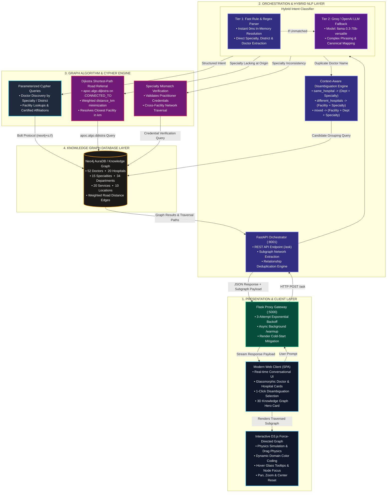
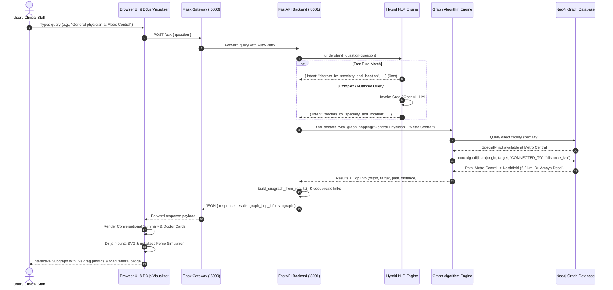

# Healthcare Knowledge Graph Assistant (HealthGraph)

An intelligent, conversational healthcare assistant powered by a **Neo4j Knowledge Graph**, **FastAPI**, **Flask**, and a **Hybrid NLP Engine (Fast Deterministic Parser + Groq/OpenAI LLM)**. HealthGraph translates natural-language clinical queries into deterministic Cypher graph traversals, providing doctor discovery, multi-hospital shortest-path referrals, smart doctor disambiguation, and interactive in-chat force-directed graph visualizations.

---

## Key Features

### 1. Interactive In-Chat Subgraph Visualizer (D3.js Force-Directed Graph)
* **Live Graph Exploration**: Every response dynamically renders an interactive, physics-based 2D force-directed graph representing the exact traversed Cypher subgraph.
* **Entity Categorization**: Nodes are visually distinct by domain type:
  * **Doctor** (`#10b981` Emerald)
  * **Hospital** (`#06b6d4` Cyan)
  * **Specialty** (`#8b5cf6` Purple)
  * **Department** (`#f59e0b` Amber)
  * **Location** (`#3b82f6` Blue)
  * **Origin Facility** (`#f43f5e` Crimson for referral origin points)
* **Interactive Controls**:
  * Drag nodes to reposition them in real time.
  * Hover over nodes for floating glassmorphic property inspection tooltips.
  * Click any node to focus on its direct neighbors and connected relationships while dimming unrelated nodes.
  * Zoom In (`+`), Zoom Out (`-`), Reset View, and Toggle Full-Width Canvas.
* **Deduplicated Relationships**: Ensures exact relationship counts across multi-doctor and shared facility nodes.

---

### 2. Multi-Hop Hospital Referrals (Dijkstra's Shortest Path Algorithm)
* **True minimum-distance routing using Dijkstra's Algorithm (`apoc.algo.dijkstra`) across the weighted `:CONNECTED_TO {distance_km}` hospital network.**
* When a requested specialty is not available at an origin facility (e.g. *"General physician at Metro Central Medical Center"*), the routing engine applies Dijkstra's algorithm to calculate the exact shortest road route across connected facilities.
* Returns the closest reachable facility offering that specialty along with the exact road distance in kilometers (e.g., *6.2 km via Northfield Community Hospital*) and step-by-step path trace (`Metro Central -> North District Specialty -> Northfield Community`).
* Includes automatic fallback to variable-length weighted path evaluation with Cypher `reduce()` distance minimization if APOC is not present.

---

### 3. Context-Aware Doctor Name Disambiguation Engine
Handles duplicate doctor names across facilities and departments without probabilistic guessing:
* **`same_hospital`** (e.g., *Dr. Aarav* -> Dr. Aarav Desai in Cardiology and Dr. Aarav Sharma in General Surgery, both at *Metro Central*):
  * Clarification Prompt: *"Multiple doctors named 'Dr. Aarav' were found at Metro Central Medical Center. Which department and specialization are you looking for?"*
* **`different_hospitals`** (e.g., *Dr. Sameer* -> *Oakridge Specialty Hospital* vs *Bayview General Hospital*):
  * Clarification Prompt: *"Multiple doctors named 'Dr. Sameer' were found across different hospitals. Which hospital and specialization are you looking for?"*
* **`mixed`** (e.g., *Dr. Vikram* -> 2 at *Apex Advanced* + 1 at *Riverdale General*):
  * Clarification Prompt: *"Multiple doctors named 'Dr. Vikram' were found across multiple hospitals and departments. Which hospital, department, and specialization are you looking for?"*
* Renders interactive candidate selection cards with **1-click clarification query buttons**.

---

### 4. Specialty Mismatch Verification & Cross-Facility Hop
* Checks if a practitioner is certified in an inquired field (e.g. *"Is Dr. Aarohi a Neurologist?"*).
* Detects that Dr. Aarohi is certified in **Cardiology**, hops across the connected facility network from her hospital (*Apex Advanced*), and returns certified specialists in **Neurology**.

---

### 5. General Doctor Discovery by District
* Supports broad geographic discovery queries (e.g. *"Doctors in North District"*, *"Find doctors in South District"*, *"Physicians in Downtown"*) returning all affiliated practitioners and departments across that district's hospitals.

---

### 6. Visual Onboarding & Tour Guide
* **3D Knowledge Graph Hero Card**: Embedded directly on the start screen with real-time entity counters (**52 Doctors**, **20 Hospitals**, **15 Specialties**, **34 Departments**).
* **Three Capability Pillars**: *Natural Discovery*, *Multi-Hop Referrals*, and *Smart Disambiguation*.
* **Onboarding Tour Modal**: Accessible via the "Tour" button in the top navigation bar and sidebar.

---

## System Architecture



### End-to-End Query Execution Pipeline



---

## Knowledge Graph Schema

### Node Types
| Label | Count | Properties |
| :--- | :--- | :--- |
| `(:Doctor)` | 52 | `doctor_id`, `name` |
| `(:Hospital)` | 20 | `hospital_id`, `name`, `type`, `beds` |
| `(:Speciality)` | 15 | `specialty_id`, `name` |
| `(:Department)` | 34 | `department_id`, `name` |
| `(:Location)` | 10 | `location_id`, `city`, `district`, `state` |
| `(:Service)` | 20 | `service_id`, `name` |

### Relationships
| Relationship | Path | Description |
| :--- | :--- | :--- |
| `:WORKS_AT` | `(Doctor) -> (Hospital)` | Connects a practitioner to their medical facility. |
| `:HAS_SPECIALTY` | `(Doctor) -> (Speciality)` | Links a practitioner to their certified specialty. |
| `:HAS_DEPARTMENT` | `(Hospital) -> (Department)` | Connects a hospital to its medical departments. |
| `:OFFERS_SPECIALTY` | `(Department) -> (Speciality)` | Maps a clinical department to its specialty. |
| `:OFFERS_SERVICE` | `(Hospital) -> (Service)` | Connects a facility to diagnostic equipment (ICU, MRI, etc.). |
| `:LOCATED_IN` | `(Hospital) -> (Location)` | Maps a hospital to its city and parent district. |
| `:CONNECTED_TO` | `(Hospital) -> (Hospital)` | Weighted road transfer network with `{distance_km: Float}`. |

---

## Example Queries

| Category | Example Question | System Behavior |
| :--- | :--- | :--- |
| **Natural Discovery** | `Cardiologists in South District` | Returns 3 cardiologists across South District hospitals with full force graph. |
| **Multi-Hop Referral** | `general physician at Metro Central Medical Center` | Traverses `:CONNECTED_TO` network to find `Dr. Amaya Desai` at Northfield Community Hospital (6.2 km away via 2 hops). |
| **Name Collision** | `Dr Aarav` | Detects same-hospital duplicate and prompts for department & specialization. |
| **Cross-Hospital Collision** | `Dr Sameer` | Detects multi-hospital duplicates and prompts for facility & specialization. |
| **Specialty Check** | `Is Dr. Aarohi a Neurologist?` | Identifies Dr. Aarohi is in Cardiology, hops across connected network, and displays certified Neurologists. |
| **District Doctors** | `Doctors in North District` | Returns all 19 practitioners across North District facilities. |
| **Hospital Doctors** | `Show doctors at Apex Advanced Medical Center` | Returns all medical staff affiliated with Apex Advanced. |

---

## Project Structure

```
├── app/
│   ├── database.py         # Neo4j connection pooling & credentials
│   ├── load_data.py        # CSV ingestion & graph schema generation
│   └── graph_queries.py    # Parameterized Cypher queries & shortest-path logic
├── backend/
│   ├── main.py             # FastAPI REST server, disambiguation & subgraph builder
│   └── llm.py              # Hybrid Intent Parser (Fast Regex + LLM fallback)
├── frontend/
│   ├── app.py              # Flask server, auto-retry & background warmup proxy
│   ├── templates/index.html# SPA interface with D3 force graph visualizer & hero UI
│   └── static/
│       ├── style.css       # Glassmorphic design system & D3 visualizer styles
│       └── onboarding_hero.jpg # 3D Healthcare Knowledge Graph artwork asset
├── data/                   # Healthcare domain CSV datasets
│   ├── doctors.csv
│   ├── hospitals.csv
│   ├── specialities.csv
│   ├── departments.csv
│   ├── locations.csv
│   ├── hospital_connections.csv
│   └── services.csv
└── requirements.txt
```

---

## Installation & Setup

### 1. Prerequisites
* Python 3.10+
* Neo4j AuraDB instance or local Neo4j Desktop
* Groq API Key (or OpenAI API Key)

### 2. Environment Configuration
Create a `.env` file in the root directory:

```env
# Neo4j Database
NEO4J_URI=neo4j+s://<your-aura-instance-id>.databases.neo4j.io
NEO4J_USERNAME=neo4j
NEO4J_PASSWORD=<your-neo4j-password>

# LLM API
GROQ_API_KEY=<your-groq-api-key>

# Backend Service URL (for Frontend Proxy)
FASTAPI_URL=http://127.0.0.1:8001
```

### 3. Install Dependencies
```bash
python3 -m venv .venv
source .venv/bin/activate
pip install -r requirements.txt
```

### 4. Ingest Data into Neo4j
```bash
python3 app/load_data.py
```

### 5. Run the Application
In separate terminal tabs:

**Start FastAPI Backend (Port 8001):**
```bash
uvicorn backend.main:app --host 127.0.0.1 --port 8001 --reload
```

**Start Flask Frontend (Port 5000):**
```bash
python3 frontend/app.py
```

Open your browser at **`http://127.0.0.1:5000`**.

---

## Deployment on Render

1. **Backend Web Service**:
   * Build Command: `pip install -r requirements.txt`
   * Start Command: `uvicorn backend.main:app --host 0.0.0.0 --port $PORT`
   * Environment Variables: `NEO4J_URI`, `NEO4J_USERNAME`, `NEO4J_PASSWORD`, `GROQ_API_KEY`
2. **Frontend Web Service**:
   * Build Command: `pip install -r requirements.txt`
   * Start Command: `python frontend/app.py`
   * Environment Variables: `FASTAPI_URL=https://<your-backend-service>.onrender.com`
   * *Note*: The frontend proxy includes an **automatic retry loop** and a **background pre-warm endpoint** (`/warmup`) to handle Render free-tier cold starts.
